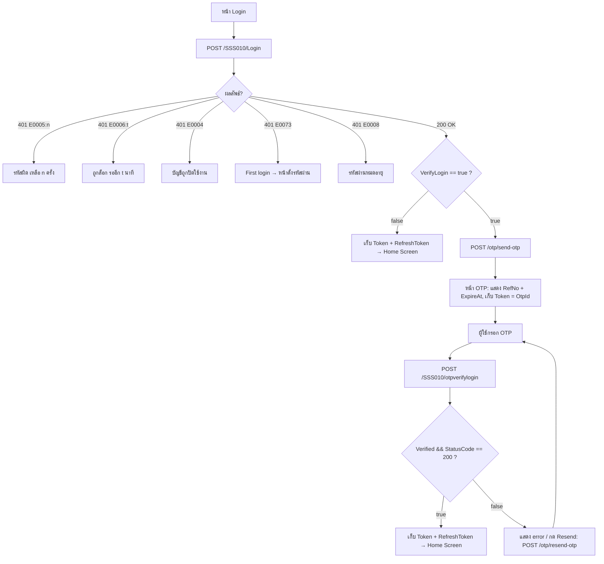
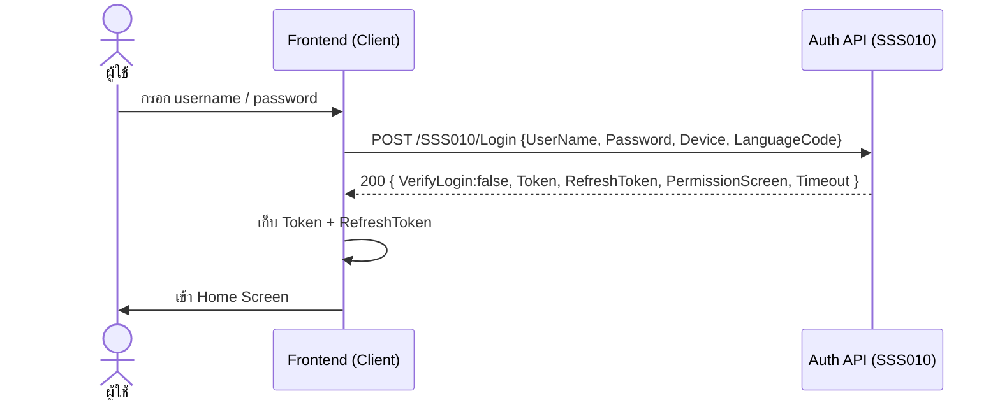
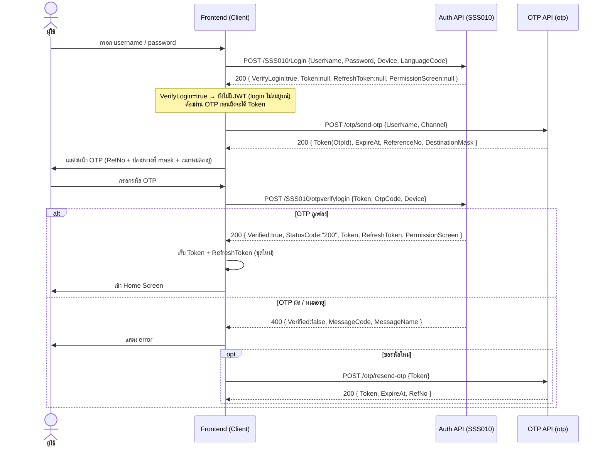

# Login Flow (สำหรับทีม Frontend)

เอกสารนี้อธิบาย flow การเข้าสู่ระบบของ API `core_api_auth` ตามพฤติกรรมจริงของโค้ด
(`SSS010Controller`, `OtpController`) เพื่อให้ฝั่ง frontend เชื่อมต่อได้ถูกต้อง

> Base path ของ controller:
> - Login / Refresh / First login / Reset password อยู่ใต้ `SSS010/...`
> - การจัดการ OTP อยู่ใต้ `otp/...`

---

## 1. แนวคิดโดยรวม

1. ผู้ใช้กรอก username/password แล้วเรียก `POST /SSS010/Login`
2. ถ้าผ่าน ดูที่ field **`VerifyLogin`** ใน response (ค่ามาจาก `OTPLogin` ของ user)
   - `VerifyLogin = false` → เข้า **Home** ได้เลย (มี `Token` + `RefreshToken` มาให้แล้ว)
   - `VerifyLogin = true` → `Token`/`RefreshToken`/`PermissionScreen` จะเป็น **`null`**
     (ระบบยังไม่ออก JWT จนกว่าจะผ่าน OTP) → ต้อง **ยืนยัน OTP** ก่อน ไปหน้า OTP
3. หน้า OTP: ขอรหัสด้วย `POST /otp/send-otp` → ผู้ใช้กรอกรหัส → `POST /SSS010/otpverifylogin`
4. ยืนยัน OTP ผ่าน → ได้ `Token` + `RefreshToken` ชุดใหม่ → เข้า **Home**

---

## 2. Flowchart



---

## 3. Sequence Diagram (แยก Client / Auth API / OTP API)

### 3.1 กรณีไม่เปิด OTP (`VerifyLogin = false`)



### 3.2 กรณีเปิด OTP (`VerifyLogin = true`)



---

## 4. รายละเอียด Endpoint

### 4.1 `POST /SSS010/Login`
เข้าสู่ระบบด้วย username/password

Request:
```json
{ "UserName": "string", "Password": "string", "Device": "web", "LanguageCode": "th" }
```

Response `200 OK` (ฟิลด์ที่ frontend ใช้):
```json
{
  "Id": "string",
  "UserNumber": 0,
  "UserName": "string",
  "DisplayName": "STRING",
  "VerifyLogin": true,
  "LanguageCode": "th",
  "Token": "jwt...",
  "RefreshToken": "string",
  "PermissionScreen": "base64(json)",
  "Timeout": 60,
  "RemindPasswordExpired": 0
}
```

หมายเหตุฟิลด์:
- `VerifyLogin` — `true` = ต้องทำ OTP ต่อ, `false` = เข้าระบบได้เลย
- เมื่อ `VerifyLogin = true` ระบบจะส่ง `Token` / `RefreshToken` / `PermissionScreen` เป็น **`null`**
  (ยังไม่ออก JWT จนกว่าจะผ่าน OTP) — ค่าจริงจะได้จากขั้น `otpverifylogin`
- `PermissionScreen` — เป็น Base64 ของ JSON `{ "ScreenId": [functionCodes...] }` ต้อง decode ก่อนใช้
- `Timeout` — อายุ JWT (นาที)
- `RemindPasswordExpired` — ถ้า > 0 หมายถึงรหัสผ่านใกล้หมดอายุ เหลืออีกกี่วัน (ใช้เตือนผู้ใช้ ไม่บล็อกการ login)

Error `401 Unauthorized` (body เป็น string code):

| Code | ความหมาย | สิ่งที่ frontend ควรทำ |
|------|----------|------------------------|
| `E0005:n` | รหัสผ่านผิด เหลือสิทธิ์อีก n ครั้ง | แสดงจำนวนครั้งที่เหลือ |
| `E0006:t` | บัญชีถูกล็อก ต้องรออีก t นาที | แสดงเวลารอ |
| `E0004` | บัญชีถูกปิดใช้งาน (inactive) | แจ้งติดต่อผู้ดูแล |
| `E0073` | First login | redirect ไปหน้าตั้งรหัสผ่านครั้งแรก |
| `E0008` | รหัสผ่านหมดอายุ | redirect ไปหน้าเปลี่ยนรหัสผ่าน |

### 4.2 `POST /otp/send-otp`
ขอรหัส OTP (เรียกเมื่อ `VerifyLogin = true`)

Request:
```json
{ "UserName": "string", "Channel": "EMAIL" }
```
`Channel` รองรับ: `EMAIL` / `SMS` / `APP`

Response `200 OK`:
```json
{ "Token": "guid", "ExpireAt": "2026-01-01T00:00:00", "ReferenceNo": "ABC123", "DestinationMask": "a***@mail.com" }
```
> เก็บ `Token` (OtpId) ไว้ใช้ตอน verify และ resend

### 4.3 `POST /SSS010/otpverifylogin`
ยืนยันรหัส OTP

Request:
```json
{ "Token": "guid", "OtpCode": "123456", "Device": "web" }
```

Response สำเร็จ `200 OK`:
```json
{
  "Verified": true,
  "StatusCode": "200",
  "MessageCode": "OTP_VERIFIED",
  "Token": "jwt...",
  "RefreshToken": "string",
  "PermissionScreen": "base64(json)",
  "Timeout": 60
}
```

Response ไม่ผ่าน `400 Bad Request`:
```json
{ "Verified": false, "StatusCode": "...", "StatusName": "...", "MessageCode": "...", "MessageName": "..." }
```

### 4.4 `POST /otp/resend-otp`
ส่ง OTP ใหม่

Request:
```json
{ "Token": "guid" }
```
Response `200 OK`:
```json
{ "Token": "guid", "ExpireAt": "2026-01-01T00:00:00", "RefNo": "ABC124" }
```

### 4.5 `POST /SSS010/RefreshToken`
ต่ออายุ session ด้วย refresh token

Request:
```json
{ "UserName": "string", "RefreshToken": "string", "LanguageCode": "th" }
```
Response `200 OK`:
```json
{ "Token": "jwt...", "RefreshToken": "string", "Timeout": 60 }
```

---

## 5. หมายเหตุด้านความปลอดภัย

endpoint `POST /SSS010/Login` จะ **ไม่ออก `Token` (JWT) / `RefreshToken` เมื่อ `VerifyLogin = true`**
(ฟิลด์เหล่านี้จะเป็น `null`) และจะไม่ตั้ง session cookie ในกรณีนั้น — JWT เต็มใบจะออกให้
ก็ต่อเมื่อผ่านขั้น `POST /SSS010/otpverifylogin` แล้วเท่านั้น

ฝั่ง frontend จึงควรปฏิบัติดังนี้:
- เมื่อ `VerifyLogin = true` ให้ถือว่า login **ยังไม่สมบูรณ์** ไม่ต้องเก็บ token (ได้ `null` อยู่แล้ว)
  redirect ไปหน้า OTP และเก็บ token จริงจากขั้น `otpverifylogin`
- เมื่อ `VerifyLogin = false` ใช้ `Token` / `RefreshToken` จาก response ของ Login ได้เลย
