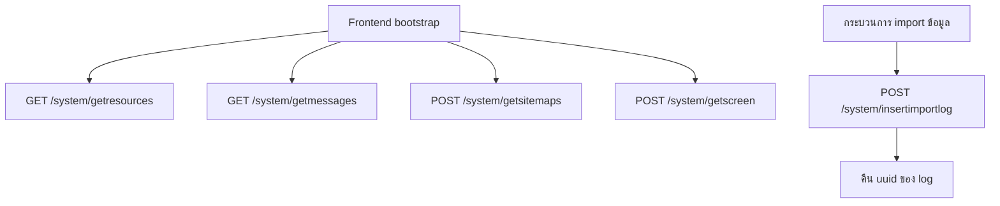
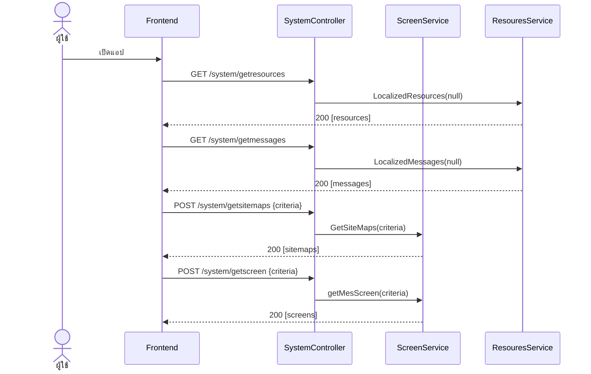

# System – Screen / Resources / Import Log (ข้อมูลระบบ)

เอกสารนี้อธิบาย workflow ของ `SystemController` ตามพฤติกรรมจริงของโค้ด
(`SystemController` → `IScreenService` / `IResouresService`)
ใช้สำหรับโหลดโครงสร้างหน้าจอ (sitemap/screen), ข้อความ localization และบันทึก import log

> Base path: `system/...`

---

## 1. แนวคิดโดยรวม

`SystemController` ให้บริการข้อมูลระดับระบบที่ frontend ใช้ตอนเริ่มต้นแอป แบ่งเป็น 3 กลุ่ม:

1. **โครงสร้างหน้าจอ** – `getscreen`, `getsitemaps` (ผ่าน `IScreenService`)
2. **ข้อมูล localization** – `getresources`, `getmessages` (ผ่าน `IResouresService`)
3. **Import Log** – `insertimportlog` (ผ่าน `IScreenService`)

หลักการสำคัญ:
- เป็น controller สำหรับ bootstrap ข้อมูลระบบ (เมนู, สิทธิ์การแสดงผล, ข้อความหลายภาษา)
- `getresources` / `getmessages` เรียกด้วย `null` criteria = ดึงข้อมูลทั้งหมด
- `insertimportlog` คืน `uuid` ของ log ที่บันทึก

---

## 2. Flowchart ภาพรวม



---

## 3. Sequence Diagram – โหลดข้อมูลตอนเปิดแอป



---

## 4. รายละเอียด Endpoint

> หมายเหตุ: controller นี้ไม่มี `ModelState` validation หรือ `try/catch` แบบ UMS0xx
> โดยตรง — ถ้าเกิด exception จะถูกจัดการตาม pipeline/filter ของระบบ

### 4.1 `POST /system/getscreen`
ดึงข้อมูลหน้าจอ (MES Screen)

Request: `MESScreenCriteria`
Response `200 OK`: ผลลัพธ์จาก `getMesScreen(criteria)`

### 4.2 `POST /system/getsitemaps`
ดึงโครงสร้างเมนู/sitemap

Request: `GetSiteMaps_Criteria`
Response `200 OK`: ผลลัพธ์จาก `GetSiteMaps(criteria)`

### 4.3 `GET /system/getresources`
ดึง localized resources ทั้งหมด (เรียกด้วย `null`)

Request: ไม่มี
Response `200 OK`: ผลลัพธ์จาก `LocalizedResources(null)`

### 4.4 `GET /system/getmessages`
ดึง localized messages ทั้งหมด (เรียกด้วย `null`)

Request: ไม่มี
Response `200 OK`: ผลลัพธ์จาก `LocalizedMessages(null)`

### 4.5 `POST /system/insertimportlog`
บันทึก import log พร้อมรายละเอียด

Request: `API_InsertImportLog_Criteria`
- `ImportLog` – ข้อมูลหัว log
- `ImportLogDetail` – รายการรายละเอียด
Response `200 OK`:
```json
{ "uuid": "<generated-id>" }
```

---

## 5. หมายเหตุ

- `getresources` / `getmessages` เป็น `GET` และดึงข้อมูลทั้งชุด (criteria = `null`)
  เหมาะกับการ cache ฝั่ง frontend ตอนเริ่มต้นแอป
- `getscreen` / `getsitemaps` เป็น `POST` ที่รับ criteria เพื่อกรองข้อมูลตามบริบทผู้ใช้/ภาษา
- attribute `[Authorize]` และ `ActionExceptionFilter` ในไฟล์ถูก comment ไว้
  ปัจจุบัน endpoint เหล่านี้จึงไม่ได้บังคับ authentication ที่ระดับ controller

---

## 6. ตัวอย่างข้อมูล (Sample Request / Response)

> ฟิลด์ที่ลงท้ายด้วย `?` ในโค้ดคือ optional (อาจเป็น `null`)
> ทั้ง `getscreen` และ `getsitemaps` รับ `SupportDeviceType` (required) เพื่อกรองตามชนิดอุปกรณ์

### 6.1 `POST /system/getscreen`

Request — `MESScreenCriteria`:
```json
{ "SupportDeviceType": "WEB" }
```

Response `200 OK` — `List<MESScreenResult>`:
```json
[
  {
    "ScreenId": "UMS010",
    "Name_EN": "User Management",
    "Name_TH": "จัดการผู้ใช้",
    "FunctionCode": 15,
    "ModuleCode": "UMS",
    "ModuleSeq": 1,
    "ModuleName_Seq": 1,
    "ModuleName_EN": "User Management",
    "ModuleName_TH": "การจัดการผู้ใช้",
    "ModuleName_IconClass": "fa-users",
    "SubModuleCode": "UMS-USER",
    "SubModuleSeq": 1,
    "SubModuleName_EN": "User",
    "SubModuleName_TH": "ผู้ใช้งาน",
    "SubModule_IconClass": "fa-user",
    "Screen_IconClass": "fa-id-card",
    "Screen_MainMenuFlag": true,
    "Screen_PermissionFlag": true,
    "Screen_Seq": 1,
    "PageTitleName_EN": "User Management",
    "PageTitleName_TH": "จัดการผู้ใช้"
  }
]
```

### 6.2 `POST /system/getsitemaps`

Request — `GetSiteMaps_Criteria`:
```json
{ "SupportDeviceType": "WEB" }
```

Response `200 OK` — `GetSiteMaps_Result` (แยก `Module` / `SubModule` / `Screen` เป็น 3 list):
```json
{
  "Module": [
    {
      "ModuleCode": "UMS",
      "Module_EN": "User Management",
      "Module_TH": "การจัดการผู้ใช้",
      "Seq": 1,
      "IconClass": "fa-users"
    }
  ],
  "SubModule": [
    {
      "SubModuleCode": "UMS-USER",
      "SubModuleName_EN": "User",
      "SubModuleName_TH": "ผู้ใช้งาน",
      "Seq": 1,
      "IconClass": "fa-user"
    }
  ],
  "Screen": [
    {
      "ScreenId": "UMS010",
      "Name_EN": "User Management",
      "Name_TH": "จัดการผู้ใช้",
      "FunctionCode": 15,
      "ModuleCode": "UMS",
      "ModuleSeq": 1,
      "ModuleName_EN": "User Management",
      "ModuleName_TH": "การจัดการผู้ใช้",
      "ModuleName_Seq": 1,
      "ModuleName_IconClass": "fa-users",
      "SubModuleCode": "UMS-USER",
      "SubModuleSeq": 1,
      "SubModuleName_EN": "User",
      "SubModuleName_TH": "ผู้ใช้งาน",
      "SubModule_IconClass": "fa-user",
      "Screen_IconClass": "fa-id-card",
      "Screen_MainMenuFlag": true,
      "Screen_PermissionFlag": true,
      "Screen_Seq": 1,
      "PageTitleName_EN": "User Management",
      "PageTitleName_TH": "จัดการผู้ใช้"
    }
  ]
}
```

### 6.3 `GET /system/getresources`

Request: ไม่มี (เรียกด้วย `null` ภายใน → ดึงทั้งหมด)

Response `200 OK` — รายการ localized resources (key/value ตามภาษา) ใช้สำหรับ label/i18n ฝั่ง frontend

### 6.4 `GET /system/getmessages`

Request: ไม่มี (เรียกด้วย `null` ภายใน → ดึงทั้งหมด)

Response `200 OK` — รายการ localized messages (ข้อความแจ้งเตือน/error ตามภาษา)
ใช้ map กับ `MessageCode` ที่ได้จาก API อื่น ๆ (เช่น UMS010/UMS030) เพื่อแสดงข้อความตามภาษาผู้ใช้

### 6.5 `POST /system/insertimportlog`

Request — `API_InsertImportLog_Criteria` (`ImportLog` = หัว log, `ImportLogDetail` = รายละเอียดราย row):
```json
{
  "ImportLog": {
    "JobLogId": "JOB-20260627-001",
    "InterfaceCode": "IF001",
    "InterfaceName": "Import Employee",
    "FtpServerName": "ftp.internal",
    "FileFolder": "/inbound",
    "InterfaceFileName": "employee_20260627.csv",
    "JobStatus": "SUCCESS",
    "ProcessBy": "system",
    "StartDateTime": "2026-06-27T01:00:00",
    "FinishDateTime": "2026-06-27T01:02:30",
    "TotalRecord": 120,
    "Remark": "นำเข้าประจำวัน"
  },
  "ImportLogDetail": [
    {
      "Id": "11111111-2222-3333-4444-555555555555",
      "JobLogId": "JOB-20260627-001",
      "RowNo": 12,
      "ErrorDetail": "รูปแบบอีเมลไม่ถูกต้อง"
    }
  ]
}
```

Response `200 OK` (controller ห่อผลลัพธ์เป็น `uuid`):
```json
{ "uuid": "<generated-import-log-id>" }
```
