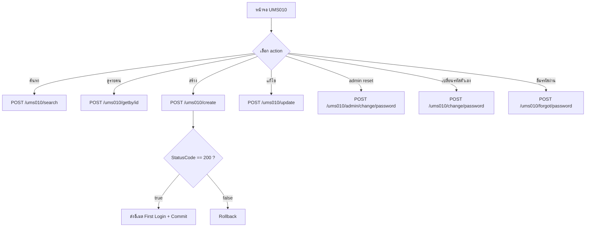

# UMS010 – User Management (จัดการผู้ใช้งาน)

เอกสารนี้อธิบาย workflow ของ `UMS010Controller` ตามพฤติกรรมจริงของโค้ด
(`UMS010Controller` → `IUMS010Service` → `IUMS010Repository`)
ใช้สำหรับการค้นหา / สร้าง / แก้ไขผู้ใช้ และการจัดการรหัสผ่าน

> Base path: `ums010/...`
> Controller ส่วนใหญ่ต้องผ่าน authentication ยกเว้น `forgot/password` ที่เป็น `[AllowAnonymous]`

---

## 1. แนวคิดโดยรวม

`UMS010` คือหน้าจอจัดการผู้ใช้งาน (User Maintenance) แบ่ง action เป็น 3 กลุ่ม:

1. **ค้นหา / ดูข้อมูล** – `search`, `getby/id`
2. **สร้าง / แก้ไข** – `create`, `update` (รันใน DB transaction)
3. **จัดการรหัสผ่าน** – `admin/change/password`, `change/password`, `forgot/password`

หลักการสำคัญ:
- การสร้าง/แก้ไขผู้ใช้ทำงานภายใน **transaction** — ถ้า repository ตอบ `StatusCode != "200"` ระบบจะ `Rollback`
- ตอน **create** สำเร็จ ระบบจะส่ง **อีเมลสำหรับ first login** (พร้อม `FirstLoginToken`) ให้อัตโนมัติ
  จากนั้นเคลียร์ `FirstLoginToken` ออกจาก response ก่อนส่งกลับ
- ฟิลด์ `CreateBy` / `UpdateBy` ถูกเซ็ตจาก `User.Identity.Name` ใน controller (ไม่รับจาก client)

---

## 2. Flowchart ภาพรวม



---

## 3. Sequence Diagram – การสร้างผู้ใช้ (Create)

```mermaid
sequenceDiagram
    actor Admin as ผู้ดูแลระบบ
    participant FE as Frontend
    participant API as UMS010Controller
    participant SVC as UMS010Service
    participant REPO as UMS010Repository
    participant MAIL as Email Service

    Admin->>FE: กรอกข้อมูลผู้ใช้ใหม่
    FE->>API: POST /ums010/create {criteria}
    API->>API: criteria.CreateBy = User.Identity.Name
    API->>SVC: CreateUser(criteria)
    SVC->>SVC: BeginTransaction
    SVC->>REPO: CreateUser(criteria)
    REPO-->>SVC: result (StatusCode, FirstLoginToken)
    alt StatusCode == "200"
        SVC->>MAIL: SendEmailFirstLogin(FullName, UserName, Password, Email, FirstLoginToken)
        SVC->>SVC: result.FirstLoginToken = "" ; Commit
        SVC-->>API: result (สำเร็จ)
    else StatusCode != "200"
        SVC->>SVC: Rollback
        SVC-->>API: result (ไม่สำเร็จ)
    end
    API-->>FE: 200 { result }
```

---

## 4. รายละเอียด Endpoint

ทุก endpoint ตอบ `400 Bad Request` เมื่อ body ว่างหรือ `ModelState` ไม่ผ่าน
และตอบ `500 Internal Server Error` เมื่อเกิด exception

### 4.1 `POST /ums010/search`
ค้นหารายการผู้ใช้ตามเงื่อนไข

Request: `UMS010_Search_Criteria`
Response `200 OK`: `List<UMS010_Search_Result>`

### 4.2 `POST /ums010/getby/id`
ดึงข้อมูลผู้ใช้รายคนตาม id

Request: `GetUserID_Info_Criteria`
Response `200 OK`: `GetUserID_Info_Result` (อาจเป็น `null` ถ้าไม่พบ)

### 4.3 `POST /ums010/create`
สร้างผู้ใช้ใหม่ (รันใน transaction + ส่งอีเมล first login)

Request: `UMS010_CreateUser_Criteria`
- `CreateBy` เซ็ตจาก `User.Identity.Name` โดย controller
Response `200 OK`: `UMS010_CreateUser_Result`
- เมื่อสำเร็จ `FirstLoginToken` จะถูกเคลียร์เป็นค่าว่างก่อนส่งกลับ

### 4.4 `POST /ums010/update`
แก้ไขข้อมูลผู้ใช้ (รันใน transaction)

Request: `UMS010_UpdateUser_Criteria`
- `UpdateBy` เซ็ตจาก `User.Identity.Name` โดย controller
Response `200 OK`: `UMS010_UpdateUser_Result`

### 4.5 `POST /ums010/admin/change/password`
ผู้ดูแลรีเซ็ตรหัสผ่านให้ผู้ใช้

Request: `UMS010_AdminChangePassword_Criteria`
Response `200 OK`: `UMS010_UpdateUser_Result`

### 4.6 `POST /ums010/change/password`
ผู้ใช้เปลี่ยนรหัสผ่านของตนเอง (รันใน transaction)

Request: `UMS010_ChangePassword_Criteria`
Response `200 OK`: `UMS010_UpdateUser_Result`

### 4.7 `POST /ums010/forgot/password`  `[AllowAnonymous]`
ขอรีเซ็ตรหัสผ่านกรณีลืม (ไม่ต้อง login)

Request: `UMS010_ForgotPassword_Criteria`
Response `200 OK`: `UMS010_ForgotPassword_Result`

---

## 5. หมายเหตุ

- `create` / `update` / `change/password` ทำงานใน DB transaction:
  commit เฉพาะเมื่อ `StatusCode == "200"` มิฉะนั้น rollback
- `search` / `getby/id` / `admin/change/password` / `forgot/password`
  เรียก repository ตรง ๆ ไม่มี transaction ครอบในชั้น service
- เมื่อเกิด exception ระหว่าง transaction บาง method จะคืน result ที่มี
  `StatusCode = "ERROR"` พร้อม `MessageCode` เฉพาะ (เช่น `SERVICE_CREATE_EXCEPTION`)

---

## 6. ตัวอย่างข้อมูล (Sample Request / Response)

> ฟิลด์ที่ลงท้ายด้วย `?` ในโค้ดคือ optional (อาจเป็น `null`)
> `StatusCode == "200"` = สำเร็จ

### 6.1 `POST /ums010/search`

Request — `UMS010_Search_Criteria`:
```json
{
  "UserName": "som",
  "Name": "สมชาย",
  "PermissionGroup": "ADMIN",
  "Department": "IT",
  "ActiveFlag": true
}
```

Response `200 OK` — `List<UMS010_Search_Result>`:
```json
[
  {
    "Id": "5f1c2b3a-...",
    "UserNumber": 1001,
    "UserName": "somchai",
    "FirstName": "สมชาย",
    "LastName": "ใจดี",
    "DisplayName": "สมชาย ใจดี",
    "DepartmentCode": "IT",
    "DisplayDepartment": "ฝ่ายไอที",
    "PositionCode": "DEV",
    "DisplayPosition": "Developer",
    "PermissionGroupId": 2,
    "DisplayPermissionGroup": "Administrator",
    "Email": "somchai@mail.com",
    "PhoneNumber": "0812345678",
    "IsActive": true,
    "Remark": null,
    "LanguageCode": "th",
    "CreateDate": "2026-01-10T09:00:00",
    "CreateBy": "admin",
    "UpdateDate": "2026-02-01T11:30:00",
    "UpdateBy": "admin",
    "LastLoginDate": "2026-06-20T08:15:00",
    "LastChangedPassword": "2026-05-01T10:00:00"
  }
]
```

### 6.2 `POST /ums010/getby/id`

Request — `GetUserID_Info_Criteria`:
```json
{ "UserId": "5f1c2b3a-..." }
```

Response `200 OK` — `GetUserID_Info_Result` (อาจเป็น `null` ถ้าไม่พบ):
```json
{
  "Id": "5f1c2b3a-...",
  "UserNumber": 1001,
  "UserName": "somchai",
  "FirstName": "สมชาย",
  "LastName": "ใจดี",
  "DepartmentCode": "IT",
  "PositionCode": "DEV",
  "Email": "somchai@mail.com",
  "PhoneNumber": "0812345678",
  "Remark": null,
  "LanguageCode": "th",
  "CreateDate": "2026-01-10T09:00:00",
  "CreateBy": "admin",
  "UpdateDate": "2026-02-01T11:30:00",
  "UpdateBy": "admin",
  "FirstLoginFlag": false,
  "ActiveFlag": true,
  "SystemAdminFlag": false,
  "PasswordAge": 56,
  "LastLoginDate": "2026-06-20T08:15:00",
  "LastUpdatePasswordDate": "2026-05-01T10:00:00",
  "ActiveDate": "2026-01-10T09:00:00",
  "InActiveDate": null
}
```

### 6.3 `POST /ums010/create`

Request — `UMS010_CreateUser_Criteria` (ไม่ต้องส่ง `CreateBy`, ระบบเซ็ตจาก token เอง):
```json
{
  "UserName": "somchai",
  "Email": "somchai@mail.com",
  "PhoneNumer": "0812345678",
  "FirstLoginFlag": true,
  "ActiveFlag": true,
  "SystemAdminFlag": false,
  "Password": "P@ssw0rd",
  "UserNumber": 1001,
  "EmployeeCode": "EMP001",
  "DepartmentCode": "IT",
  "PositionCode": "DEV",
  "FirstName": "สมชาย",
  "LastName": "ใจดี",
  "Remark": null,
  "LanguageCode": "th"
}
```
> หมายเหตุ: ชื่อฟิลด์เบอร์โทรในโมเดลคือ `PhoneNumer` (สะกดตามโค้ดจริง)

Response `200 OK` — `UMS010_CreateUser_Result` (`FirstLoginToken` ถูกเคลียร์เป็น `""` เมื่อสำเร็จ):
```json
{
  "StatusCode": "200",
  "StatusName": "สำเร็จ",
  "MessageCode": "CREATE_SUCCESS",
  "MessageName": "สร้างผู้ใช้สำเร็จ",
  "UserId": 1001,
  "Username": "somchai",
  "FirstLoginToken": ""
}
```

### 6.4 `POST /ums010/update`

Request — `UMS010_UpdateUser_Criteria` (ไม่ต้องส่ง `UpdateBy`):
```json
{
  "Id": "5f1c2b3a-...",
  "Email": "somchai@mail.com",
  "PhoneNumer": "0899999999",
  "FirstLoginFlag": false,
  "ActiveFlag": true,
  "SystemAdminFlag": false,
  "UserNumber": 1001,
  "UserName": "somchai",
  "FirstName": "สมชาย",
  "LastName": "ใจดี",
  "DepartmentCode": "IT",
  "PositionCode": "DEV",
  "Remark": "ปรับเบอร์โทร",
  "LanguageCode": "th"
}
```

Response `200 OK` — `UMS010_UpdateUser_Result`:
```json
{
  "StatusCode": "200",
  "StatusName": "สำเร็จ",
  "MessageCode": "UPDATE_SUCCESS",
  "MessageName": "แก้ไขผู้ใช้สำเร็จ",
  "UserName": "somchai"
}
```

### 6.5 `POST /ums010/admin/change/password`

Request — `UMS010_AdminChangePassword_Criteria`:
```json
{ "UserName": "somchai", "NewPassword": "N3wP@ss!" }
```

Response `200 OK` — `UMS010_UpdateUser_Result`:
```json
{
  "StatusCode": "200",
  "StatusName": "สำเร็จ",
  "MessageCode": "RESET_SUCCESS",
  "MessageName": "รีเซ็ตรหัสผ่านสำเร็จ",
  "UserName": "somchai"
}
```

### 6.6 `POST /ums010/change/password`

Request — `UMS010_ChangePassword_Criteria`:
```json
{ "UserName": "somchai", "OldPassword": "P@ssw0rd", "NewPassword": "N3wP@ss!" }
```

Response `200 OK` — `UMS010_UpdateUser_Result`:
```json
{
  "StatusCode": "200",
  "StatusName": "สำเร็จ",
  "MessageCode": "CHANGE_PASSWORD_SUCCESS",
  "MessageName": "เปลี่ยนรหัสผ่านสำเร็จ",
  "UserName": "somchai"
}
```

### 6.7 `POST /ums010/forgot/password`  `[AllowAnonymous]`

Request — `UMS010_ForgotPassword_Criteria`:
```json
{ "Email": "somchai@mail.com" }
```

Response `200 OK` — `UMS010_ForgotPassword_Result`:
```json
{
  "StatusCode": "200",
  "StatusName": "สำเร็จ",
  "MessageCode": "FORGOT_PASSWORD_SENT",
  "MessageName": "ส่งลิงก์รีเซ็ตรหัสผ่านไปยังอีเมลแล้ว",
  "Token": "reset-token-guid"
}
```

### 6.8 รูปแบบ Error ทั่วไป (กรณี exception)
```json
{
  "StatusCode": "ERROR",
  "StatusName": "ไม่สำเร็จ",
  "MessageCode": "SERVICE_CREATE_EXCEPTION",
  "MessageName": "<ข้อความ exception>"
}
```
`MessageCode` ที่เป็นไปได้: `SERVICE_CREATE_EXCEPTION`, `SERVICE_UPDATE_EXCEPTION`, `SERVICE_CHANGE_PASSWORD_EXCEPTION`
