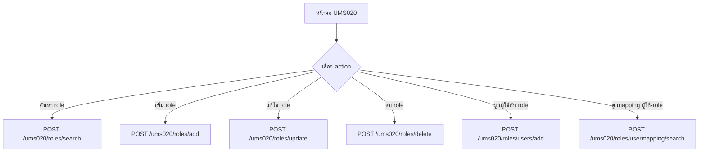
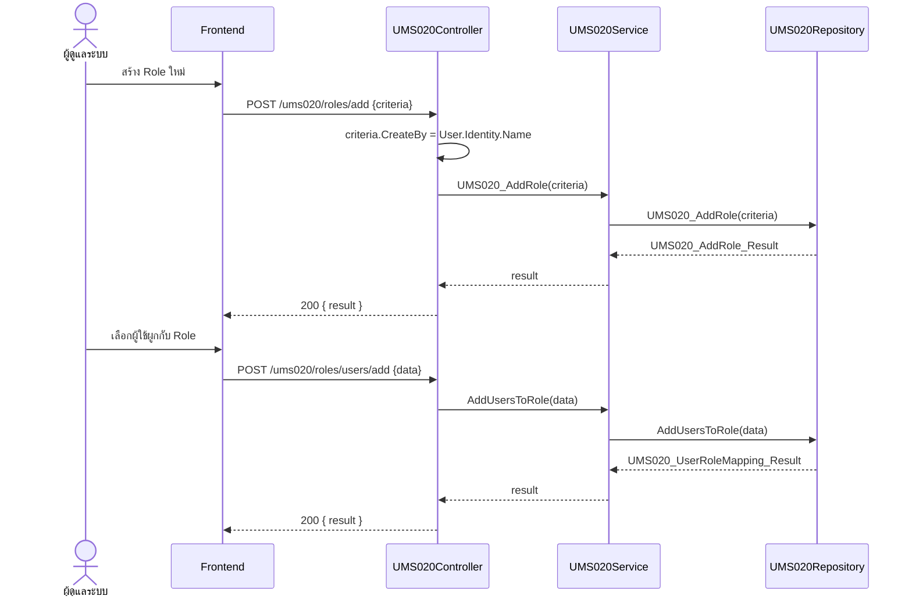

# UMS020 – Role Management (จัดการบทบาท/สิทธิ์กลุ่มผู้ใช้)

เอกสารนี้อธิบาย workflow ของ `UMS020Controller` ตามพฤติกรรมจริงของโค้ด
(`UMS020Controller` → `IUMS020Service` → `IUMS020Repository`)
ใช้สำหรับจัดการ Role และการผูกผู้ใช้เข้ากับ Role

> Base path: `ums020/...`

---

## 1. แนวคิดโดยรวม

`UMS020` คือหน้าจอจัดการบทบาท (Role) แบ่ง action เป็น 2 กลุ่ม:

1. **จัดการ Role** – `roles/search`, `roles/add`, `roles/update`, `roles/delete`
2. **ผูกผู้ใช้กับ Role** – `roles/users/add`, `roles/usermapping/search`

หลักการสำคัญ:
- `roles/add` และ `roles/update` เซ็ต `CreateBy` / `UpdateBy` จาก `User.Identity.Name` ใน controller
- ชั้น service เป็น pass-through ไปยัง repository (มี `try/catch` แล้ว `throw` ต่อ)
  จึงไม่มี DB transaction ครอบในชั้น service สำหรับ controller นี้

---

## 2. Flowchart ภาพรวม



---

## 3. Sequence Diagram – เพิ่ม Role และผูกผู้ใช้



---

## 4. รายละเอียด Endpoint

ทุก endpoint ตอบ `400 Bad Request` เมื่อ body ว่างหรือ `ModelState` ไม่ผ่าน
และตอบ `500 Internal Server Error` เมื่อเกิด exception

### 4.1 `POST /ums020/roles/search`
ค้นหา Role ตามเงื่อนไข

Request: `UMS020_SearchRole_Criteria`
Response `200 OK`: `List<MS020_SearchRole_Result>`

### 4.2 `POST /ums020/roles/add`
เพิ่ม Role ใหม่

Request: `UMS020_AddRole_Criteria`
- `CreateBy` เซ็ตจาก `User.Identity.Name` โดย controller
Response `200 OK`: `UMS020_AddRole_Result`

### 4.3 `POST /ums020/roles/update`
แก้ไข Role

Request: `UMS020_UpdateRole_Criteria`
- `UpdateBy` เซ็ตจาก `User.Identity.Name` โดย controller
Response `200 OK`: `UMS020_UpdateRole_Result`

### 4.4 `POST /ums020/roles/delete`
ลบ Role

Request: `UMS020_DeleteRole_Criteria`
Response `200 OK`: `UMS020_DeleteRole_Result`

### 4.5 `POST /ums020/roles/users/add`
ผูกผู้ใช้หลายคนเข้ากับ Role

Request: `UMS020_UserRoleMapping_Criteria`
Response `200 OK`: `UMS020_UserRoleMapping_Result`

### 4.6 `POST /ums020/roles/usermapping/search`
ดึงข้อมูลการ map ระหว่างผู้ใช้กับ Role

Request: `UMS020_GetUserRoleMapping_Criteria`
Response `200 OK`: `UMS020_GetUserRoleMapping_Result`

---

## 5. หมายเหตุ

- Controller นี้ไม่มี transaction ครอบในชั้น service — ทุก method เรียก repository ตรง ๆ
  ถ้าเกิด exception จะถูก `throw` ขึ้นมาให้ controller จับและตอบ `500`
- การควบคุมความถูกต้องของข้อมูล (validation) อาศัย `ModelState` ของแต่ละ criteria

---

## 6. ตัวอย่างข้อมูล (Sample Request / Response)

> ฟิลด์ที่ลงท้ายด้วย `?` ในโค้ดคือ optional (อาจเป็น `null`)
> ใน UMS020 "Role" = กลุ่มสิทธิ์ (Group); ฟิลด์ `Id` / `RoleId` เป็น string (GUID)

### 6.1 `POST /ums020/roles/search`

Request — `UMS020_SearchRole_Criteria`:
```json
{
  "GroupName": "Admin",
  "GroupDescription": null,
  "UserName": null,
  "Status": true
}
```

Response `200 OK` — `List<MS020_SearchRole_Result>` (`Detail` = ผู้ใช้ในกลุ่ม):
```json
[
  {
    "Id": "a1b2c3d4-...",
    "Name": "Administrator",
    "NormalizedName": "ADMINISTRATOR",
    "Description": "กลุ่มผู้ดูแลระบบ",
    "IsActive": true,
    "CreateBy": "admin",
    "CreateDate": "2026-01-05T09:00:00",
    "UpdateBy": "admin",
    "UpdateDate": "2026-02-10T14:00:00",
    "Detail": [
      {
        "UserId": "5f1c2b3a-...",
        "Username": "somchai",
        "name": "สมชาย ใจดี",
        "DepartmentCode": "IT",
        "DisplayDepartmentCode": "ฝ่ายไอที",
        "PositionCode": "DEV",
        "DisplayPosition": "Developer"
      }
    ]
  }
]
```

### 6.2 `POST /ums020/roles/add`

Request — `UMS020_AddRole_Criteria` (ไม่ต้องส่ง `CreateBy`, ระบบเซ็ตจาก token):
```json
{
  "Name": "Operator",
  "NormalizedName": "OPERATOR",
  "Description": "กลุ่มผู้ปฏิบัติงาน",
  "IsActive": true
}
```

Response `200 OK` — `UMS020_AddRole_Result`:
```json
{
  "StatusCode": "200",
  "StatusName": "สำเร็จ",
  "MessageCode": "ADD_ROLE_SUCCESS",
  "MessageName": "เพิ่มบทบาทสำเร็จ"
}
```

### 6.3 `POST /ums020/roles/update`

Request — `UMS020_UpdateRole_Criteria` (สืบทอดจาก AddRole + `Id`; ไม่ต้องส่ง `UpdateBy`):
```json
{
  "Id": "a1b2c3d4-...",
  "Name": "Operator",
  "NormalizedName": "OPERATOR",
  "Description": "กลุ่มผู้ปฏิบัติงาน (แก้ไข)",
  "IsActive": true
}
```

Response `200 OK` — `UMS020_UpdateRole_Result` (โครงสร้างเดียวกับ AddRole_Result):
```json
{
  "StatusCode": "200",
  "StatusName": "สำเร็จ",
  "MessageCode": "UPDATE_ROLE_SUCCESS",
  "MessageName": "แก้ไขบทบาทสำเร็จ"
}
```

### 6.4 `POST /ums020/roles/delete`

Request — `UMS020_DeleteRole_Criteria` (สืบทอดจาก AddRole + `Id`; โดยปกติส่งแค่ `Id`):
```json
{ "Id": "a1b2c3d4-..." }
```

Response `200 OK` — `UMS020_DeleteRole_Result`:
```json
{
  "StatusCode": "200",
  "StatusName": "สำเร็จ",
  "MessageCode": "DELETE_ROLE_SUCCESS",
  "MessageName": "ลบบทบาทสำเร็จ"
}
```

### 6.5 `POST /ums020/roles/users/add`

Request — `UMS020_UserRoleMapping_Criteria` (ผูกผู้ใช้หลายคนเข้ากลุ่ม):
```json
{
  "RoleId": "a1b2c3d4-...",
  "Users": ["5f1c2b3a-...", "6a2d3e4b-..."],
  "User": null,
  "jsonListUser": null
}
```
> มีหลายช่องทางในการส่งรายชื่อผู้ใช้: `Users` (array), `User` (รายเดียว) หรือ `jsonListUser` (JSON string) — แนะนำใช้ `Users`

Response `200 OK` — `UMS020_UserRoleMapping_Result`:
```json
{
  "StatusCode": "200",
  "StatusName": "สำเร็จ",
  "MessageCode": "MAPPING_SUCCESS",
  "MessageName": "ผูกผู้ใช้กับบทบาทสำเร็จ"
}
```

### 6.6 `POST /ums020/roles/usermapping/search`

Request — `UMS020_GetUserRoleMapping_Criteria`:
```json
{ "RoleId": "a1b2c3d4-..." }
```

Response `200 OK` — `UMS020_GetUserRoleMapping_Result`
(`UserListInRole` = อยู่ในกลุ่มแล้ว, `UserListOutRole` = ยังไม่ได้อยู่ในกลุ่ม):
```json
{
  "UserListOutRole": [
    {
      "UserId": "7b3c4d5e-...",
      "UserName": "wichai",
      "DisplayFullName": "วิชัย รักงาน",
      "DisplayDepartment": "ฝ่ายบัญชี"
    }
  ],
  "UserListInRole": [
    {
      "UserId": "5f1c2b3a-...",
      "UserName": "somchai",
      "DisplayFullName": "สมชาย ใจดี",
      "DisplayDepartment": "ฝ่ายไอที"
    }
  ]
}
```

### 6.7 หมายเหตุเรื่อง Error

UMS020 ในชั้น service ใช้รูปแบบ `try/catch` แล้ว `throw` ต่อ — เมื่อเกิด exception
controller จะตอบ `500 Internal Server Error` (ไม่ได้คืน object `StatusCode = "ERROR"` แบบ UMS010/UMS030)
