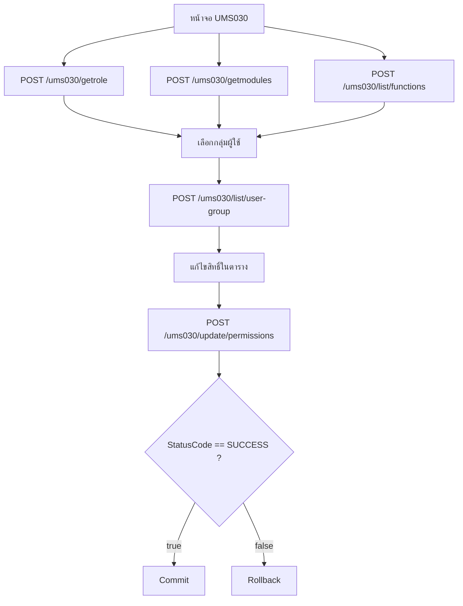
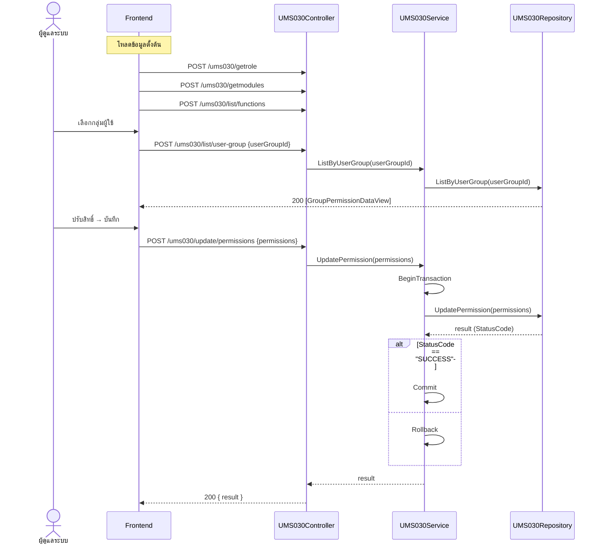

# UMS030 – Permission Management (จัดการสิทธิ์การเข้าถึงหน้าจอ)

เอกสารนี้อธิบาย workflow ของ `UMS030Controller` ตามพฤติกรรมจริงของโค้ด
(`UMS030Controller` → `IUMS030Service` → `IUMS030Repository`)
ใช้สำหรับกำหนดสิทธิ์ (Group Permission) ของแต่ละกลุ่มผู้ใช้ต่อหน้าจอ/ฟังก์ชัน

> Base path: `ums030/...`

---

## 1. แนวคิดโดยรวม

`UMS030` คือหน้าจอกำหนดสิทธิ์การเข้าถึง (Permission Matrix) มี action ดังนี้:

1. **โหลดข้อมูลตั้งต้น** – `getrole`, `getmodules`, `list/functions`
2. **ดูสิทธิ์ปัจจุบันของกลุ่ม** – `list/user-group`
3. **บันทึกสิทธิ์** – `update/permissions` (รันใน DB transaction)

ลำดับการใช้งานทั่วไป:
- โหลด Role (`getrole`) และ Module/Screen (`getmodules`, `list/functions`) มาแสดงเป็นตาราง
- เลือกกลุ่มผู้ใช้ → ดึงสิทธิ์เดิมด้วย `list/user-group`
- ผู้ใช้ปรับ checkbox สิทธิ์ → บันทึกด้วย `update/permissions`

หลักการสำคัญ:
- `update/permissions` ทำงานภายใน **transaction** — commit เฉพาะเมื่อ
  `StatusCode == "SUCCESS"` มิฉะนั้น rollback
- หาก exception ระหว่าง transaction จะคืน result `StatusCode = "ERROR"`
  พร้อม `MessageCode = "SERVICE_CREATE_EXCEPTION"`

---

## 2. Flowchart ภาพรวม



---

## 3. Sequence Diagram – บันทึกสิทธิ์



---

## 4. รายละเอียด Endpoint

`getrole` / `getmodules` เรียก service ตรง (ไม่มีการตรวจ `ModelState` ใน controller)
ส่วน endpoint อื่นจะตอบ `500 Internal Server Error` เมื่อเกิด exception

### 4.1 `POST /ums030/getrole`
ดึงรายการ Role สำหรับแสดงในตารางสิทธิ์

Request: `UMS030_GetRoles_Criteria`
Response `200 OK`: `List<UMS030_GetRoles_Result>`

### 4.2 `POST /ums030/getmodules`
ดึงรายการ Module/Screen

Request: `UMS030_GetModule_Criteria`
Response `200 OK`: `List<UMS030_GetModule_Result>`

### 4.3 `POST /ums030/list/functions`
ดึงรายการฟังก์ชันของหน้าจอทั้งหมด (Screen Function)

Request: ไม่มี body
Response `200 OK`: `IEnumerable<ts_ScreenFunction>`

### 4.4 `POST /ums030/list/user-group`
ดึงสิทธิ์ปัจจุบันของกลุ่มผู้ใช้

Request: `UMS030_ListByUserGroup_Criteria` (ใช้ฟิลด์ `userGroupId`)
Response `200 OK`: `IEnumerable<GroupPermissionDataView>`

### 4.5 `POST /ums030/update/permissions`
บันทึกการเปลี่ยนแปลงสิทธิ์ (รันใน transaction)

Request: `UMS030_UpdatePermission_Criteria`
Response `200 OK`: `UMS030_UpdatePermission_Result`
- commit เมื่อ `StatusCode == "SUCCESS"` มิฉะนั้น rollback

---

## 5. หมายเหตุ

- มีเพียง `update/permissions` ที่ทำงานใน DB transaction; endpoint อื่นเป็น read-only
- เกณฑ์ commit ของ UMS030 ใช้ค่า `StatusCode == "SUCCESS"`
  (ต่างจาก UMS010 ที่ใช้ `"200"`) — ระวังเมื่อเทียบ behavior ข้าม module
- `list/user-group` และ `update/permissions` มีโค้ด validation บางส่วนถูก comment ไว้
  (เช่น ตรวจ `userGroupId <= 0`) ปัจจุบันจึงไม่ได้บังคับใน controller

---

## 6. ตัวอย่างข้อมูล (Sample Request / Response)

> ใน UMS030 "Group" = กลุ่มผู้ใช้/บทบาท (อ้างด้วย `GroupId` / `userGroupId` ซึ่งตรงกับ `Id` ของ Role ใน UMS020)
> `ScreenFunctionCode` / `PermissionFunctionCode` / `FunctionCode` เป็น bitmask ของฟังก์ชันในหน้าจอนั้น
> `update/permissions` สำเร็จเมื่อ `StatusCode == "SUCCESS"` (ต่างจาก UMS010 ที่ใช้ `"200"`)

### 6.1 `POST /ums030/getrole`

Request — `UMS030_GetRoles_Criteria`:
```json
{ "Id": null, "RolesName": "Admin", "IsActive": true }
```

Response `200 OK` — `List<UMS030_GetRoles_Result>`:
```json
[
  {
    "Id": "a1b2c3d4-...",
    "Name": "Administrator",
    "NormalizedName": "ADMINISTRATOR",
    "Description": "กลุ่มผู้ดูแลระบบ",
    "IsActive": true
  }
]
```

### 6.2 `POST /ums030/getmodules`

Request — `UMS030_GetModule_Criteria`:
```json
{ "Id": null, "ModuleCode": null, "IsActive": true }
```

Response `200 OK` — `List<UMS030_GetModule_Result>`:
```json
[
  {
    "Id": 1,
    "ModuleCode": "UMS",
    "ModuleNameEN": "User Management",
    "ModuleNameTH": "การจัดการผู้ใช้",
    "Seq": 1,
    "Icon": "fa-users"
  }
]
```

### 6.3 `POST /ums030/list/functions`

Request: ไม่มี body (ส่ง `{}` หรือ body ว่างได้)

Response `200 OK` — `IEnumerable<ts_ScreenFunction>` (โครงสร้างตามตาราง `ts_ScreenFunction`):
```json
[
  { "FunctionCode": 1, "FunctionName": "View" },
  { "FunctionCode": 2, "FunctionName": "Add" },
  { "FunctionCode": 4, "FunctionName": "Edit" },
  { "FunctionCode": 8, "FunctionName": "Delete" }
]
```
> ค่า `FunctionCode` เป็นเลขฐานสอง (1,2,4,8,...) ใช้รวมกันแบบ bitmask
> เช่น View+Add+Edit = `1+2+4 = 7`

### 6.4 `POST /ums030/list/user-group`

Request — `UMS030_ListByUserGroup_Criteria`:
```json
{ "userGroupId": "a1b2c3d4-..." }
```

Response `200 OK` — `IEnumerable<GroupPermissionDataView>`
(หนึ่งแถวต่อหนึ่งหน้าจอ พร้อมข้อมูล module/submodule และสิทธิ์ปัจจุบัน):
```json
[
  {
    "ModuleCode": "UMS",
    "ModuleName": "การจัดการผู้ใช้",
    "SubModuleCode": "UMS-USER",
    "SubModuleName": "ผู้ใช้งาน",
    "Seq": 1,
    "ScreenId": "UMS010",
    "ScreenName": "จัดการผู้ใช้",
    "ScreenFunctionCode": 15,
    "PermissionFunctionCode": 7
  }
]
```
> `ScreenFunctionCode` = ฟังก์ชันทั้งหมดที่หน้าจอนี้รองรับ (เช่น 15 = View+Add+Edit+Delete)
> `PermissionFunctionCode` = สิทธิ์ที่กลุ่มนี้ได้รับจริง (เช่น 7 = View+Add+Edit, ไม่มี Delete)

### 6.5 `POST /ums030/update/permissions`

Request — `UMS030_UpdatePermission_Criteria` (ส่งสิทธิ์เป็น list ราย screen):
```json
{
  "GroupId": "a1b2c3d4-...",
  "UpdateDate": "2026-06-27T10:00:00",
  "UpdateBy": "admin",
  "GroupPermissionData": [
    {
      "GroupId": "a1b2c3d4-...",
      "ScreenId": "UMS010",
      "FunctionCode": 7,
      "CreateDate": "2026-06-27T10:00:00",
      "CreateBy": "admin",
      "UpdateDate": "2026-06-27T10:00:00",
      "UpdateBy": "admin"
    },
    {
      "GroupId": "a1b2c3d4-...",
      "ScreenId": "UMS020",
      "FunctionCode": 1,
      "CreateDate": "2026-06-27T10:00:00",
      "CreateBy": "admin",
      "UpdateDate": "2026-06-27T10:00:00",
      "UpdateBy": "admin"
    }
  ]
}
```

Response สำเร็จ `200 OK` — `UMS030_UpdatePermission_Result`:
```json
{
  "StatusCode": "SUCCESS",
  "StatusName": "สำเร็จ",
  "MessageCode": "UPDATE_PERMISSION_SUCCESS",
  "MessageName": "บันทึกสิทธิ์สำเร็จ"
}
```

Response กรณี exception:
```json
{
  "StatusCode": "ERROR",
  "StatusName": "ไม่สำเร็จ",
  "MessageCode": "SERVICE_CREATE_EXCEPTION",
  "MessageName": "<ข้อความ exception>"
}
```

### 6.6 สรุปการนำไปใช้ฝั่ง Frontend (Permission Matrix)

1. โหลด `getrole` → ได้รายการกลุ่มให้เลือก
2. โหลด `getmodules` + `list/functions` → สร้างหัวตาราง (module/screen × function)
3. เลือกกลุ่ม → เรียก `list/user-group` → เทียบ `PermissionFunctionCode` (bitmask)
   กับแต่ละ `FunctionCode` เพื่อ tick checkbox
   - ตรวจว่ามีสิทธิ์ไหม: `(PermissionFunctionCode & FunctionCode) == FunctionCode`
4. ผู้ใช้แก้ checkbox → รวมเป็น `FunctionCode` ใหม่ของแต่ละ screen → ส่ง `update/permissions`
